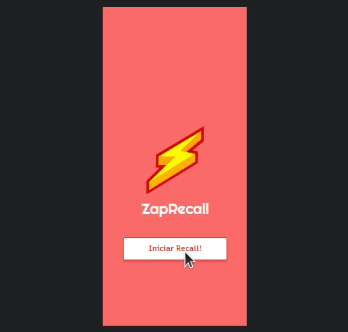

# ZapRecall

Flashcards are cards that have a question/statement on the front and an answer on the back. You can use them to train your memory with Active Recall and Spaced Repetition methodologies. The idea is to read the question or statement and try to remember the answer. In front of it, depending on the effort required to respond or not to the flashcard, you know which contents are fresh in your memory and which are not, so you can frequently practice the contents that are not.



Try it out now at https://zap-recall-ten-alpha.vercel.app/

## Technologies

<p>
    
    
</p>

## How to run

1. Clone this repository
2. Install dependencies
```bash
npm i
```
3. Run the front-end with
```bash
npm start
```
4. You can optionally build the project running
```bash
npm run build
```
5. Finally access http://localhost:3000 on your favorite browser. 
